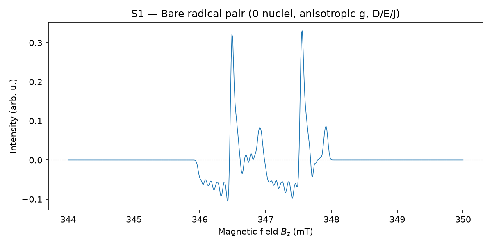
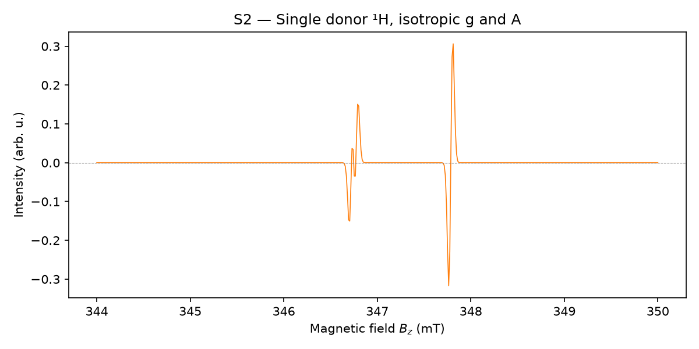
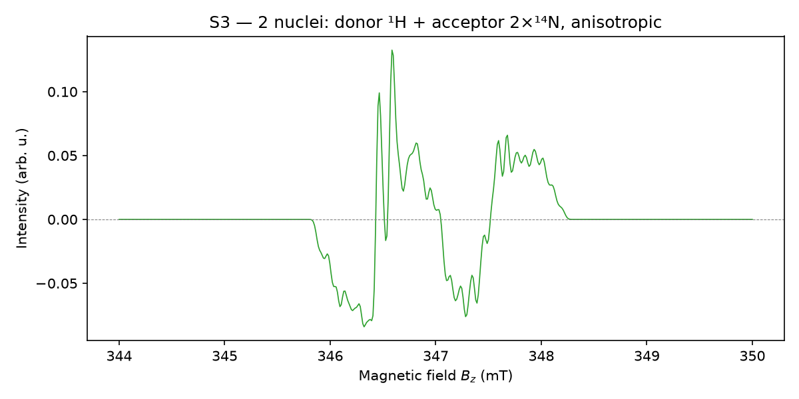
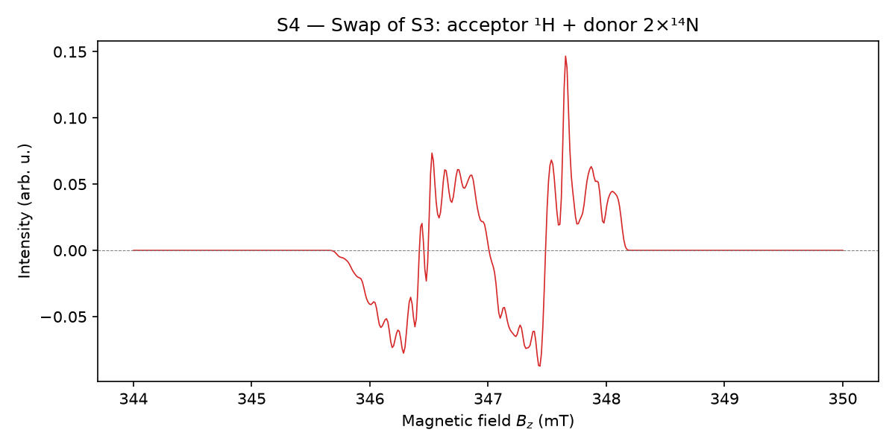
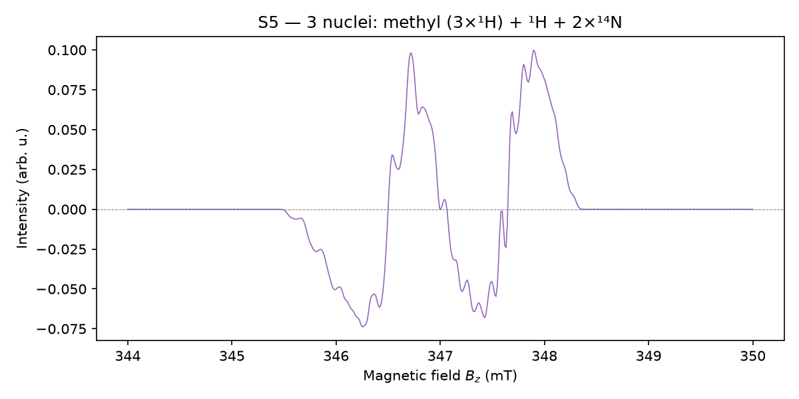
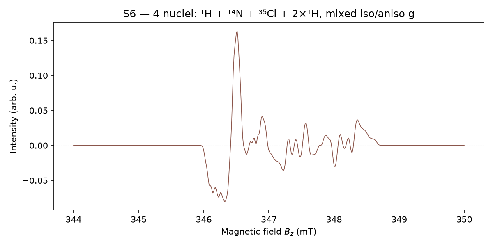
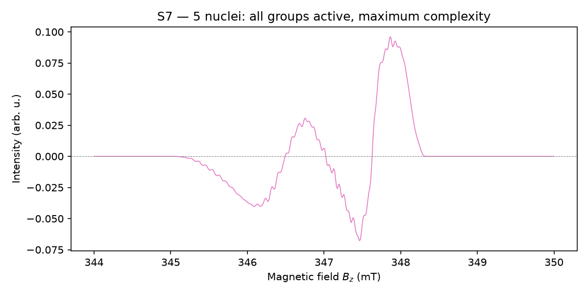
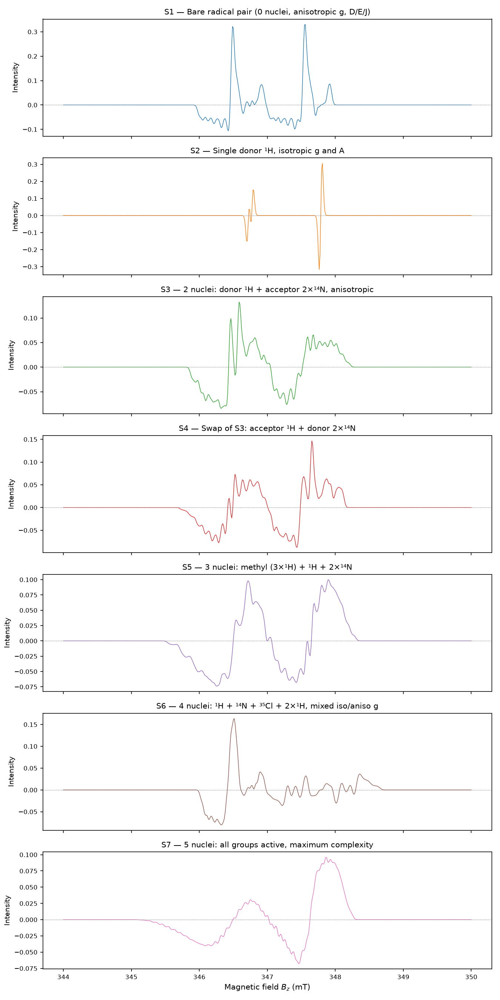

Examples
========

This page provides worked examples showing how to use ``radpair`` to
simulate cw-EPR spectra of spin-correlated radical pairs.  All examples
use typed dataclass objects (``Spinsystem``, ``Experiment``,
``SimulationOptions`` from :mod:`radpair._types`) to define the spin
system, experiment, and simulation options, which is the simplest way
to get started.

The example scripts are available in the ``examples/`` directory of the
source distribution.  Each script is self-contained and can be run with::

    uv run python examples/<script_name>.py

.. note::

   The examples require `Matplotlib <https://pypi.org/project/matplotlib/>`_
   for plotting, which is included in the dev dependencies.  Install with
   ``uv sync --dev`` or ``pip install matplotlib``.

Common setup
------------

All seven example spectra share the same X-band experiment and simulation
options:

.. code-block:: python

   import numpy as np
   from radpair._types import Experiment, SimulationOptions

   # Experiment: X-band EPR, 9.75 GHz, field sweep 344–350 mT
   field_axis = np.linspace(344.0, 350.0, 500)

   experiment = Experiment(
       B_z=field_axis,
       freq_mw=9.75e9,            # Hz
   )

   # Simulation options: 12 orientation grid knots, single core
   simopt = SimulationOptions(
       grid_points=12,
       refinement=1,
       cpu_cores=1,
   )

The :func:`~radpair.core.do_simulation` function takes three arguments
— ``spinsystem``, ``experiment``, ``simopt`` — and returns a
real-valued intensity array matching the shape of ``experiment.B_z``.

.. code-block:: python

   from radpair.core import do_simulation

   intensity = do_simulation(spinsystem, experiment, simopt)

Unit conventions
~~~~~~~~~~~~~~~~

+------------------------------+----------------------------------------------+
| Attribute                    | Unit                                         |
+==============================+==============================================+
| ``Experiment.B_z``           | milliTesla                                   |
+------------------------------+----------------------------------------------+
| ``Experiment.freq_mw``       | Hz                                           |
+------------------------------+----------------------------------------------+
| ``Spinsystem.A_tensors``     | MHz (list of 3-element arrays)               |
+------------------------------+----------------------------------------------+
| ``Spinsystem.D``, ``E``      | MHz                                          |
+------------------------------+----------------------------------------------+
| ``Spinsystem.J_ex``          | MHz                                          |
+------------------------------+----------------------------------------------+
| ``Spinsystem.width_gauss``   | milliTesla (despite the name)                |
+------------------------------+----------------------------------------------+
| ``Spinsystem.*_frame``       | radians (Euler angles [α, β, γ])             |
+------------------------------+----------------------------------------------+
| ``Spinsystem.g1``, ``g2``    | dimensionless (3-element diagonal)           |
+------------------------------+----------------------------------------------+
| ``Spinsystem.nuclei_n``      | list of equivalent-nuclei counts (int ≥ 0)   |
+------------------------------+----------------------------------------------+
| ``Spinsystem.nuclei_I``      | list of nuclear spins (float, ½ multiples)   |
+------------------------------+----------------------------------------------+
| ``Spinsystem.donor_list``    | 0-indexed list of donor nuclei positions     |
+------------------------------+----------------------------------------------+
| ``Spinsystem.acceptor_list`` | 0-indexed list of acceptor nuclei positions  |
+------------------------------+----------------------------------------------+

Example 1: Bare radical pair (S1)
---------------------------------

The simplest anisotropic radical pair: two radicals with anisotropic
g-tensors, nonzero ZFS (*D* = 8 MHz, *E* = 1.5 MHz) and exchange
(*J* = 2 MHz), but no resolved hyperfine couplings.

.. code-block:: python

   from radpair._types import Spinsystem

   _zero = np.array([0.0, 0.0, 0.0])

   spinsystem = Spinsystem(
       g1=np.array([2.0023, 2.0040, 2.0060]),
       g2=np.array([2.0080, 2.0100, 2.0120]),
       A_tensors=[_zero, _zero, _zero, _zero, _zero],
       nuclei_n=[0, 0, 0, 0, 0],
       nuclei_I=[0.0, 0.0, 0.0, 0.0, 0.0],
       D=8.0, E=1.5, J_ex=2.0,
       width_gauss=0.05,
       g1_frame=np.array([0.1, 0.2, 0.0]),
       g2_frame=np.array([0.0, 0.3, 0.1]),
       D_frame=np.array([0.2, 0.1, 0.0]),
       A_frames=[_zero, _zero, _zero, _zero, _zero],
       donor_list=[], acceptor_list=[],
   )

   intensity = do_simulation(spinsystem, experiment, simopt)

Example 2: Single donor nucleus, isotropic (S2)
------------------------------------------------

One donor proton with isotropic g-tensors and isotropic hyperfine
coupling (*A* = 1.5 MHz).  The acceptor is "silent" (no nuclei,
isotropic g).  A small exchange (*J* = 0.1 MHz) is present; ZFS is zero.

.. code-block:: python

   spinsystem = Spinsystem(
       g1=np.array([2.0030, 2.0030, 2.0030]),
       g2=np.array([2.0090, 2.0090, 2.0090]),
       A_tensors=[np.array([1.5, 1.5, 1.5]), _zero, _zero, _zero, _zero],
       nuclei_n=[1, 0, 0, 0, 0],
       nuclei_I=[0.5, 0.0, 0.0, 0.0, 0.0],
       D=0.0, E=0.0, J_ex=0.1,
       width_gauss=0.05,
       g1_frame=_zero, g2_frame=_zero, D_frame=_zero,
       A_frames=[_zero, _zero, _zero, _zero, _zero],
       donor_list=[0], acceptor_list=[],
   )

Example 3: Two anisotropic nuclei, mixed donor/acceptor (S3)
-------------------------------------------------------------

A more realistic system: the donor carries one ¹H with anisotropic
hyperfine coupling (*A*₀ = [5, 3, 4] MHz), and the acceptor carries two
equivalent ¹⁴N nuclei (*I* = 1, *n* = 2, *A*₁ = [2.5, 1.8, 3.2] MHz).
Both g-tensors are anisotropic, and ZFS (*D* = 8, *E* = 1.5 MHz) and
exchange (*J* = 3 MHz) are nonzero.  Several Euler frames are nonzero,
so tensors are rotated relative to the lab frame.

.. code-block:: python

   spinsystem = Spinsystem(
       g1=np.array([2.0020, 2.0040, 2.0060]),
       g2=np.array([2.0080, 2.0100, 2.0120]),
       A_tensors=[
           np.array([5.0, 3.0, 4.0]),
           np.array([2.5, 1.8, 3.2]),
           _zero, _zero, _zero,
       ],
       nuclei_n=[1, 2, 0, 0, 0],
       nuclei_I=[0.5, 1.0, 0.0, 0.0, 0.0],
       D=8.0, E=1.5, J_ex=3.0,
       width_gauss=0.05,
       g1_frame=np.array([0.1, 0.2, 0.0]),
       g2_frame=np.array([0.0, 0.3, 0.1]),
       D_frame=np.array([0.2, 0.1, 0.0]),
       A_frames=[
           np.array([0.0, 0.1, 0.0]),
           np.array([0.1, 0.0, 0.0]),
           _zero, _zero, _zero,
       ],
       donor_list=[0], acceptor_list=[1],
   )

Example 4: Donor/acceptor swap (S3 vs S4)
------------------------------------------

Systems S3 and S4 are identical except that the donor and acceptor nuclei
assignments are swapped.  This demonstrates how the same nuclei produce
different spectra depending on which radical they belong to — the
MHz-to-Tesla conversion uses different g-tensors for donor vs. acceptor
nuclei.

.. code-block:: python

   # S4: same as S3 but with swapped assignments
   spinsystem_S4 = Spinsystem(
       # ... (same g, A_tensors, D, E, J_ex, frames as S3) ...
       donor_list=[1],      # was [0] in S3
       acceptor_list=[0],   # was [1] in S3
   )

   intensity_S3 = do_simulation(spinsystem_S3, experiment, simopt)
   intensity_S4 = do_simulation(spinsystem_S4, experiment, simopt)

Example 5: Three nuclei with methyl group (S5)
----------------------------------------------

Donor with a methyl group (3 equivalent ¹H, *n* = 3) plus a single ¹H,
acceptor with 2 equivalent ¹⁴N.  All tensors are anisotropic.

Example 6: Four nuclei with ³⁵Cl (S6)
--------------------------------------

Donor with one ¹H, acceptor with ¹⁴N + ³⁵Cl (*I* = 3/2) + 2×¹H.
The donor g-tensor is isotropic while the acceptor g-tensor is
anisotropic.

Example 7: Five nuclei, maximum complexity (S7)
------------------------------------------------

All five nuclei groups are active (3 donor + 2 acceptor), with anisotropic
g-tensors, full ZFS (*D* = 10, *E* = 2 MHz), exchange (*J* = 5 MHz), and
multiple nuclear spins (*I* = ½, 1, 3/2) and multiplicities (*n* = 1, 2).

.. code-block:: python

   spinsystem = Spinsystem(
       g1=np.array([2.0020, 2.0040, 2.0060]),
       g2=np.array([2.0080, 2.0100, 2.0120]),
       A_tensors=[
           np.array([4.5, 3.0, 5.5]),
           np.array([2.0, 1.5, 2.8]),
           np.array([6.0, 4.0, 8.0]),
           np.array([1.5, 1.0, 2.0]),
           np.array([3.0, 2.0, 4.0]),
       ],
       nuclei_n=[1, 2, 1, 1, 2],
       nuclei_I=[0.5, 1.0, 1.5, 0.5, 0.5],
       D=10.0, E=2.0, J_ex=5.0,
       width_gauss=0.05,
       g1_frame=np.array([0.1, 0.2, 0.0]),
       g2_frame=np.array([0.0, 0.3, 0.1]),
       D_frame=np.array([0.2, 0.1, 0.0]),
       A_frames=[
           np.array([0.1, 0.0, 0.0]),
           np.array([0.0, 0.1, 0.0]),
           np.array([0.1, 0.1, 0.0]),
           _zero, _zero,
       ],
       donor_list=[0, 1, 2], acceptor_list=[3, 4],
   )

Multi-core simulation
---------------------

For computationally expensive systems, :func:`~radpair.core.do_simulation_multicore`
splits the field axis across multiple CPU processes via
:class:`multiprocessing.Pool`.  The result is numerically identical to
the single-core call.

.. code-block:: python

   from radpair._types import SimulationOptions
   from radpair.core import do_simulation_multicore

   simopt_multicore = SimulationOptions(
       grid_points=12,
       refinement=1,
       cpu_cores=4,   # use 4 worker processes (0 = auto-detect)
   )

   intensity = do_simulation_multicore(spinsystem, experiment, simopt_multicore)

   Overview of all seven example spectra (S1–S7), showing the increasing
   spectral complexity as more nuclei groups are added.

Available example scripts
-------------------------

All scripts are in the ``examples/`` directory and can be run individually:

.. list-table::
   :header-rows: 1
   :widths: 40 60

   * - Script
     - Description
   * - ``minimal_radical_pair.py``
     - S1: bare radical pair, 0 nuclei
   * - ``single_nucleus.py``
     - S2: single donor ¹H, isotropic
   * - ``anisotropic_two_nuclei.py``
     - S3: 2 nuclei, mixed donor/acceptor, anisotropic
   * - ``donor_acceptor_swap.py``
     - S3 vs S4: donor/acceptor swap comparison
   * - ``full_five_nuclei.py``
     - S7: 5 nuclei, maximum complexity
   * - ``multicore.py``
     - Multi-core simulation demo
   * - ``generate_all_plots.py``
     - Generate all 7 spectra plots for the docs
